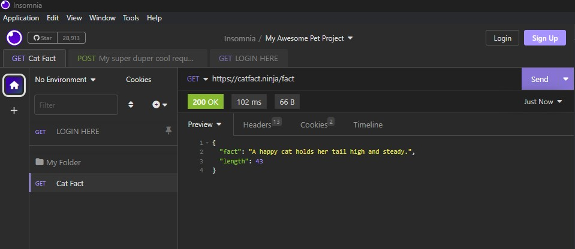

If you like this plugin, [leave it a :star: on Github!](https://github.com/NickRimmer/insomnia-plugin-request-navigator)

# About

Playing hide-and-seek with requests in the Insomnia? It's high time to level-up your game with the 'Request Navigator' plugin! It turns your open requests into tabs faster than a magician pulls rabbits out of a hat. Switching between them is now as simple as hopping from one sitcom episode to another on a lazy Sunday. Fancy some control? Sort or close the tabs as you please - this plugin listens to you better than your pet. It's all about bringing the fun back into your workflow, and making handling multiple requests feel like a walk in the park.

# How to contribute

Contributions, issues and feature requests are welcome. Feel free to open
an [issue](https://github.com/NickRimmer/insomnia-plugin-request-navigator/issues) or create
a [pull request](https://github.com/NickRimmer/insomnia-plugin-request-navigator/pulls).
